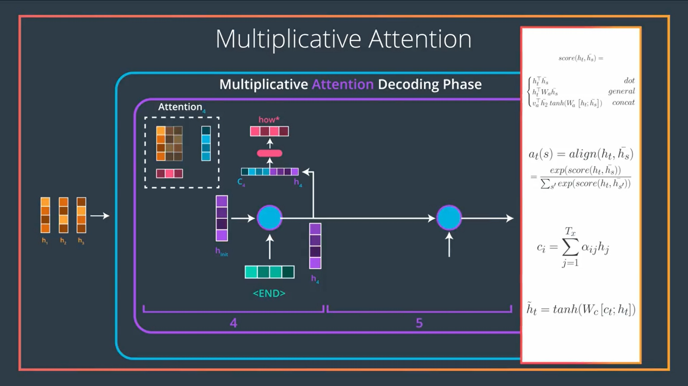

# Attention 

## Overview
This project contains the implementation of Luong's Attention from scratch in Python, along with a supportive IPYNB Notebook. The notebook contains plots and explanations to make the concept easy to understand.

## What is Attention?

Technically, the key concept of __Attention__ is to calculate an `attention weight vector` or the `context vector`, which is then used to amplify the signal from of most relevant parts of the input sequence, and in the same time drown out the irrelevant parts.

## How it works?

It involves the following steps:

    1) calculate the attention scores for the hidden states
    2) apply softmax on the attention scores
    3) weigh the hidden states according to the softmax scores
    4) concatenate the weighted vectors to obtain the `context vector`


The context vector is then concatenated with the current decoder hidden state and passed it through a Feed Forward Network to produce the result of this decoding time step. 

We will repeat the above steps to generate the output at every time-step untill some terminating condition is fulfilled.

The complete steps can be summarized using the below picture:




## Usage

The Attention layer accepts two inputs:

    query: current time-step decoder hidden state  
        -> (batch_size, hidden_dim) 
    key: all encoder all hidden state           
        -> (batch_size, seq_len, hidden_dim) 
        
The layer returns the context vector of shape `(batch_size, 1, hidden_dim)` for the current time-step.
                
*Note: The scoring method applied in the `AttentionLayer()` requires that the embedding dimension of both encoder and decoder are same*

```
# simple test
batch_size = 2
hidden_dim = 10
seq_len = 5

dec_hidden_state  = tf.constant(np.random.rand(batch_size, hidden_dim), dtype=tf.float32)
enc_hidden_states = tf.constant(np.random.rand(batch_size, seq_len, hidden_dim), dtype=tf.float32) 

attn_layer = Attention()
cv = attn_layer(dec_hidden_state, enc_hidden_states)
```

The shape of cv is `TensorShape([2, 1, 10])`, ie the `AttentionLayer()` returns context vector of shape `(1, hidden_dim)` for all the rows, as expected.
